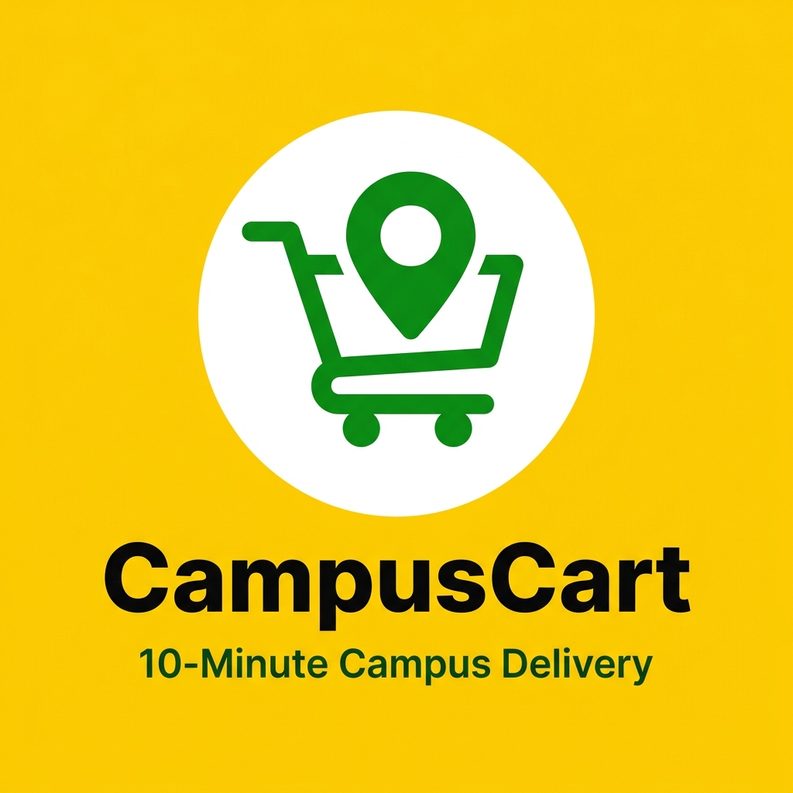
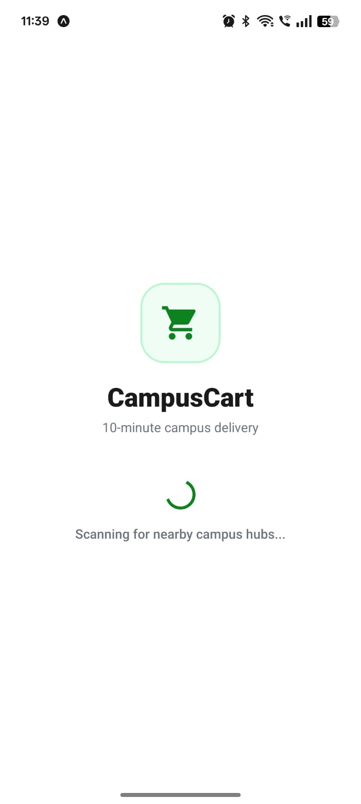
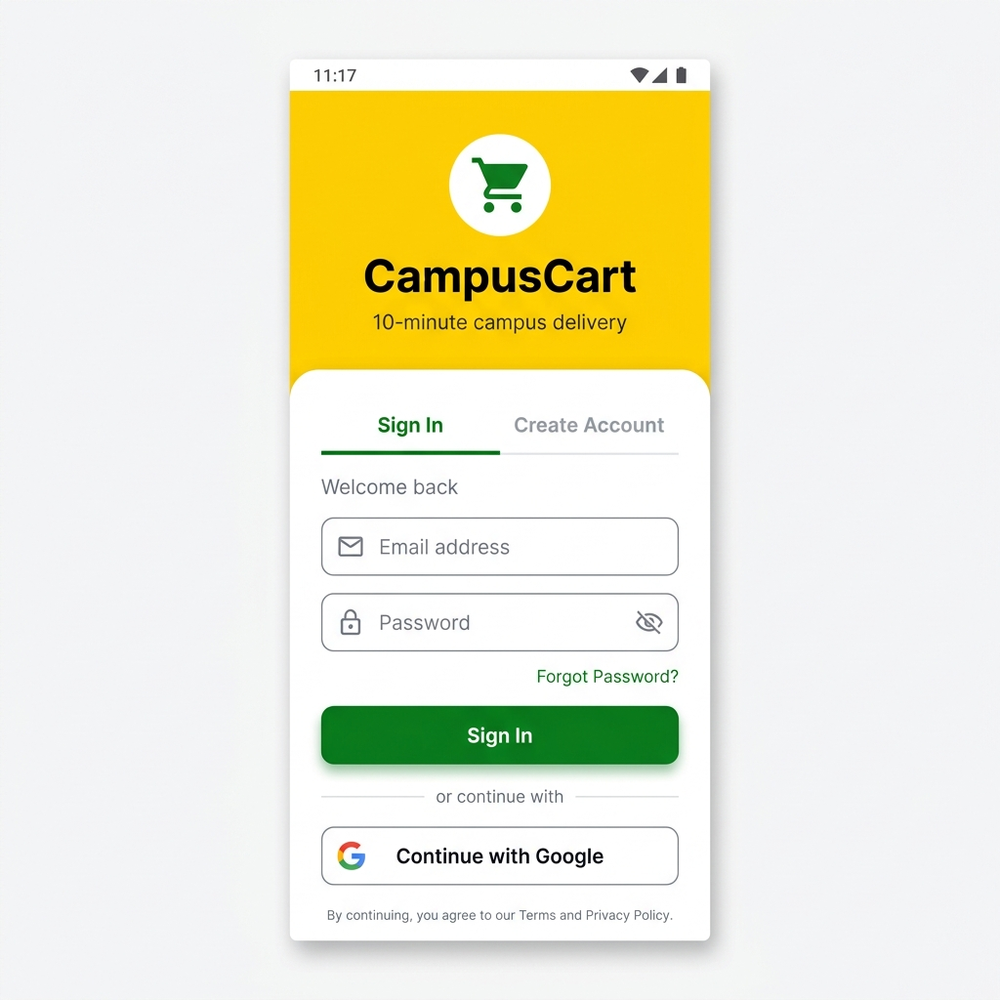
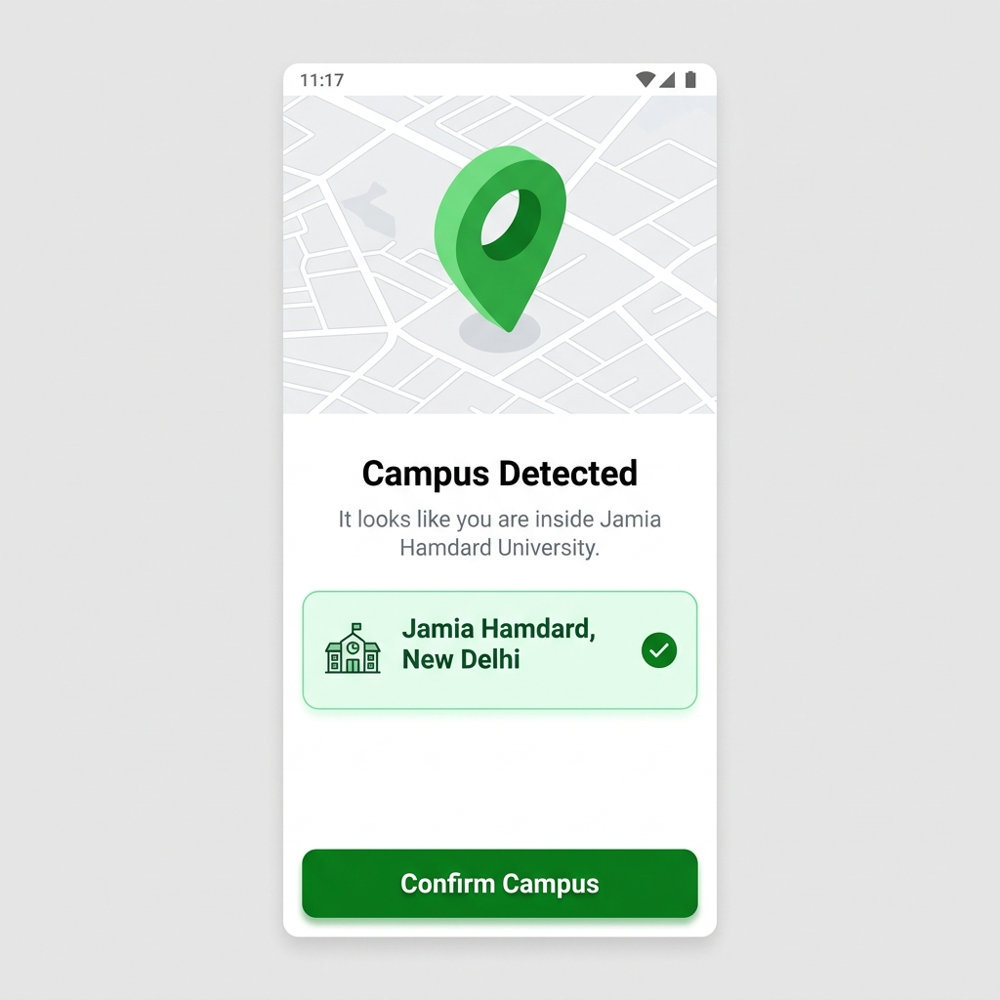
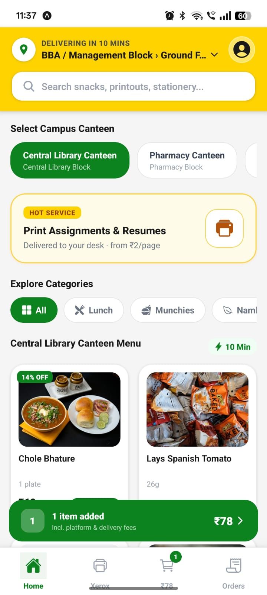
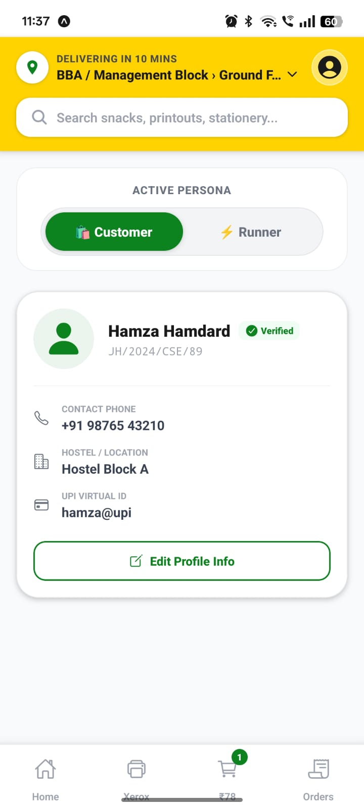
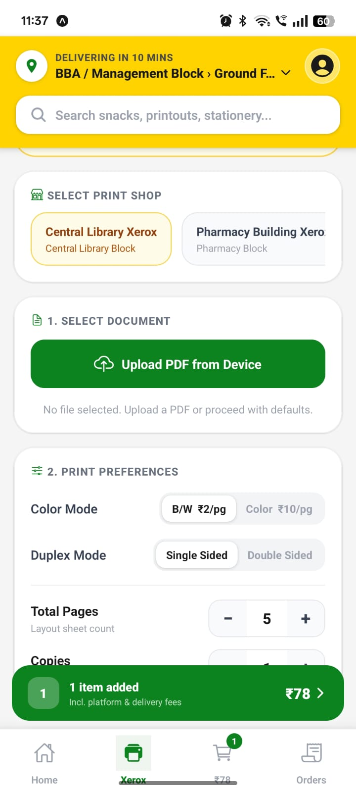
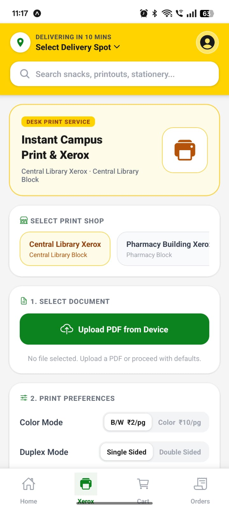
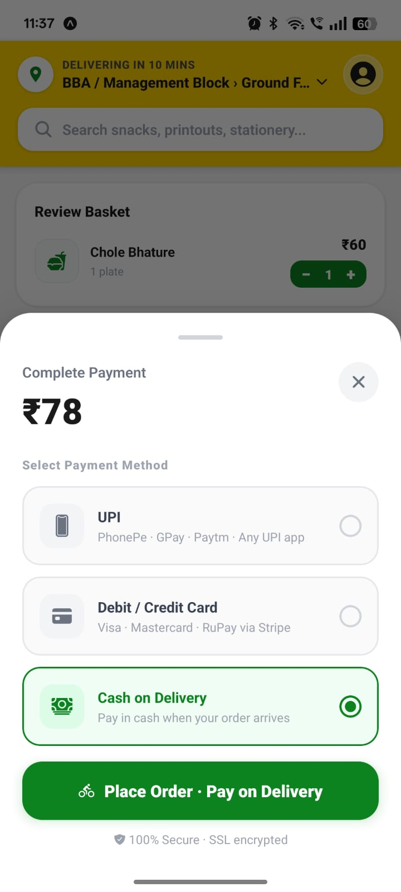
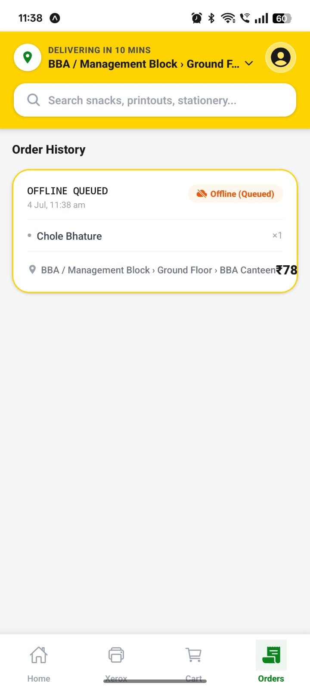

<div align="center">
  
</div>

# CampusCart

**10-minute campus delivery. Food, stationery, and xerox services delivered to your room.**

CampusCart is a full-stack cross-platform mobile application built for university campuses. It solves a real problem that every hostel student faces: getting food, stationery, or printouts from the other side of campus without leaving their room. Students can order from any canteen or xerox shop on campus and have it delivered within 10 minutes by fellow students who earn money by running deliveries.

The app operates in two distinct modes. In Customer mode, a student browses canteens and services, adds items to the cart, selects a delivery location anywhere on campus, pays via UPI or card, and tracks their order in real time. In Runner mode, a student switches their role, goes active, and starts receiving nearby delivery jobs based on their GPS location. They accept a job, pick up the order from the canteen, and deliver it to the customer's exact room or desk, earning a delivery fee per successful drop-off.

The pilot campus is Jamia Hamdard University, New Delhi, with all campus buildings, blocks, floors, and rooms mapped inside the application.

---

## Screenshots

The following screens demonstrate the complete user journey from launch to order completion.

### Splash and Onboarding

<table>
  <tr>
    <td align="center" width="33%">
      <br/>
      <b>Splash Screen</b><br/>
      <sub>App launch with branding</sub>
    </td>
    <td align="center" width="33%">
      <br/>
      <b>Authentication</b><br/>
      <sub>Sign in and registration</sub>
    </td>
    <td align="center" width="33%">
      <br/>
      <b>Campus Detection</b><br/>
      <sub>Auto-detects Jamia Hamdard campus</sub>
    </td>
  </tr>
</table>

### Home and Menu

<table>
  <tr>
    <td align="center" width="50%">
      <br/>
      <b>Home Screen</b><br/>
      <sub>Canteen catalog with search and menu cards</sub>
    </td>
    <td align="center" width="50%">
      <br/>
      <b>Profile</b><br/>
      <sub>User info, earnings, and role switcher</sub>
    </td>
  </tr>
</table>

### Xerox and Printing

<table>
  <tr>
    <td align="center" width="50%">
      <br/>
      <b>Xerox Screen</b><br/>
      <sub>Print shop selector and document upload</sub>
    </td>
    <td align="center" width="50%">
      <br/>
      <b>Print Preferences</b><br/>
      <sub>Color mode, duplex, copies, and page range</sub>
    </td>
  </tr>
</table>

### Cart and Payment

<table>
  <tr>
    <td align="center" width="50%">
      <br/>
      <b>Cart and Order Review</b><br/>
      <sub>Items, delivery location picker, and bill summary</sub>
    </td>
    <td align="center" width="50%">
      <br/>
      <b>Card Payment via Stripe</b><br/>
      <sub>Native Stripe payment sheet for secure card payments</sub>
    </td>
  </tr>
</table>

### Order History

<table>
  <tr>
    <td align="center">
      <br/>
      <b>Order History</b><br/>
      <sub>Real-time order status with item breakdown and delivery location</sub>
    </td>
  </tr>
</table>


---

## The Problem

A student living in Hostel Block A at Jamia Hamdard has a submission in 10 minutes. The BBA Canteen or the Recharge Zone is on the opposite end of the 50-acre campus. Going there and coming back takes 25 to 30 minutes. There was no solution for this.

CampusCart makes every corner of the campus reachable in under 10 minutes without the customer moving an inch.

---

## Key Features

### Splash Screen and Branding
The app opens with a branded splash screen showing the CampusCart logo and tagline. The splash screen handles the initial Firebase session check in the background. If a user is already authenticated, they are routed directly to the campus home screen. If not, they land on the authentication screen.

### Authentication
Firebase Authentication is used for sign-in and registration. The app supports email and password authentication. User sessions are persisted across app restarts using React Native AsyncStorage, which is wired to the Firebase Auth persistence layer via `getReactNativePersistence`. On first launch, new users complete a profile setup where they enter their display name, phone number, and UPI ID for earning payouts as runners.

### Campus Auto-Detection
On entering the app, the CampusScanner component requests the user's GPS location using Expo Location. It computes the Haversine distance between the user's coordinates and all registered campus hubs. The nearest hub within range is automatically selected. In the pilot deployment, the Jamia Hamdard hub loads all campus data from a locally bundled JSON file which contains all blocks, floors, nodes, canteens, and xerox shops.

### Home Screen and Canteen Catalog
The home screen presents a horizontally scrollable canteen selector at the top. Tapping a canteen loads its full menu catalog in a card grid below. Each product card shows the item image loaded from Unsplash, the name, weight or quantity, current price, and a crossed-out original price if a discount applies. An add button on each card places the item into the cart. The menu covers categories including Lunch, Snacks, Beverages, and Namkeen. Canteens in the pilot include Central Library Canteen, Pharmacy Canteen, BBA Canteen, Classic Cafe, Hakeem Abdul Hameed Hospital Canteen, and Recharge Zone.

### Search
A global search bar at the top of the home screen filters across the entire menu catalog in real time. The `useSearchFilter` custom hook performs fuzzy matching against item names, descriptions, and categories. Clearing the search restores the full catalog instantly. Typing while on any other tab automatically switches back to the home tab.

### Xerox and Printing Screen
A dedicated Xerox screen provides access to campus printing and document services. Multiple xerox shop locations are listed and selectable. The menu includes black and white printing per page, colour printing, A3 poster printing, thesis printing, spiral binding, hard cover binding, A4 lamination, document scanning, ID card printing, express priority printing, and more. Xerox services use the same cart system as food orders and can be mixed in a single order.

### Cart Screen
The cart screen gives a full review of the basket before checkout. It shows each item with its category icon, name, quantity stepper (plus and minus controls), and line total. Below the items, a delivery location section prompts the user to choose their exact delivery spot using the Location Picker. The bill summary breaks down item subtotal, platform fee of 3 rupees, and delivery fee of 15 rupees into a grand total. The Proceed to Pay button is disabled until a delivery location is selected and activates the payment flow.

### Location Picker
The location picker uses a three-step hierarchical drill-down. The user first selects a building or block from the campus, then selects a floor, and finally selects a specific room or node. All location data is sourced from the locally bundled campus JSON file. The selected location is stored as a human-readable breadcrumb string such as "Hostel Block A > Ground Floor > Room 101" and displayed throughout the order flow.

### Payment Gateway
CampusCart integrates a production-grade dual payment system.

**UPI Payment**: When the customer selects UPI, they enter their UPI ID such as name@paytm or name@okicici. The app constructs a standard UPI deep link with the merchant VPA, amount, transaction reference, and note, then fires it using Expo Linking. This launches whatever UPI app the user has installed on their phone, including PhonePe, Google Pay, Paytm, or BHIM, with all payment details pre-filled. After returning from the UPI app, the customer confirms payment completion in the app.

**Card Payment**: When the customer selects Debit or Credit Card, the app calls a Node.js Express backend server which creates a Stripe PaymentIntent with the order amount in paise. The client secret is returned to the app and passed to Stripe React Native's `initPaymentSheet`. The native Stripe Payment Sheet is then presented, providing PCI-compliant card input with support for Visa, Mastercard, and RuPay.

**Cash on Delivery**: The customer can choose to pay in cash when the runner arrives. The order is placed immediately with a COD status. The success screen displays a delivery illustration and clearly states that payment will be collected on arrival.

The Stripe backend runs as a separate Express server in the `server/` directory, initialized with a Stripe Secret Key from environment variables.

### Order History
The orders screen displays a chronological list of all past and active orders. Each order card shows the order ID, timestamp formatted for Indian locale, canteen or shop name, a color-coded status badge (Order Placed, Preparing, Out for Delivery, Delivered, or Offline Queued), a per-item breakdown with quantity badge and individual item price, the delivery location, and the grand total. Orders are fetched from Firestore in real time using TanStack Query.

### Offline Order Queue
If the device loses internet connectivity while placing an order, the order is saved to a local offline queue using MMKV storage (falling back to an in-memory Map in Expo Go). A background synchronizer hook, `useOfflineSync`, retries queued orders against Firestore up to a maximum of 5 attempts with exponential back-off. Orders sitting in the queue appear in the order history with an "Offline Queued" status badge so the customer knows they are pending.

### Real-Time Order Tracking
Once an order is placed, customers can track its status in real time. Firestore `onSnapshot` listeners push status changes from the runner's device to the customer's screen without any polling. The status progression is: Order Placed, Preparing, Out for Delivery, and Delivered.

### Push Notifications
The app uses Expo Notifications with Firebase Cloud Messaging for push alerts. Notification channels are configured on Android for standard order updates and for runner geofence job alerts. On development builds, customers receive push notifications when their order status changes. Runners receive notifications when a new job appears near their location.

### Runner Dashboard
Switching to Runner mode transforms the app into a delivery management console.

A large active toggle at the top controls whether the runner is accepting jobs. When active, the runner's GPS position is monitored in the background using Expo Task Manager and Expo Location. The `useGeofence` hook computes the distance between the runner and all registered canteen locations. When a runner enters within 500 metres of a canteen that has pending orders, a push notification fires alerting them to an available job.

The runner dashboard displays all available nearby orders as job cards, each showing the order ID, canteen name, items to pick up, delivery destination, and the earnings amount for that delivery. The runner taps Accept to claim a job. Once accepted, the full order details appear with the customer's phone number (tappable to call them directly), delivery address, and action buttons to update the status through Preparing, Out for Delivery, and Delivered. On marking an order as delivered, the delivery fee is credited to the runner's total earnings displayed on the dashboard. The runner's cumulative earnings and completed delivery count are tracked in their profile.

### Profile Screen
The profile screen displays the user's photo, display name, email, phone number, and UPI ID. Runners see their total earnings and total deliveries completed. Users can switch between Customer and Runner modes from the profile screen. The profile screen is accessible via the profile avatar icon in the top navigation bar.

---

## Architecture

```
CampusCart/
├── src/
│   ├── components/
│   │   ├── screens/           # Full-page screen components
│   │   │   ├── HomeScreen.tsx
│   │   │   ├── XeroxScreen.tsx
│   │   │   ├── CartScreen.tsx
│   │   │   ├── OrdersScreen.tsx
│   │   │   ├── ProfileScreen.tsx
│   │   │   ├── RunnerDashboard.tsx
│   │   │   ├── TrackingScreen.tsx
│   │   │   └── PaymentModal.tsx
│   │   ├── ui/                # Reusable UI components
│   │   │   ├── Header.tsx
│   │   │   ├── BottomBar.tsx
│   │   │   ├── ProductCard.tsx
│   │   │   ├── CartFloatingBar.tsx
│   │   │   ├── LocationPicker.tsx
│   │   │   └── RunnerJobCard.tsx
│   │   └── CampusScanner.tsx  # Campus detection gate
│   ├── hooks/
│   │   ├── useOrders.ts        # Firestore order CRUD + TanStack Query
│   │   ├── useRunnerJobs.ts    # Real-time job listener for runners
│   │   ├── useGeofence.ts      # Background GPS geofence engine
│   │   ├── useOfflineSync.ts   # Offline queue processor
│   │   └── useSearchFilter.ts  # Live search hook
│   ├── store/
│   │   ├── useAppStore.ts      # Global app state (Zustand + MMKV)
│   │   ├── useCartStore.ts     # Cart + pending orders state
│   │   └── useRunnerStore.ts   # Runner mode state
│   ├── utils/
│   │   ├── firebase.ts         # Firebase app, auth, Firestore, storage
│   │   └── notifications.ts    # Notification setup and helpers
│   ├── storage/
│   │   └── mmkv.ts             # MMKV storage adapter + Zustand middleware
│   └── main/
│       └── checkout.tsx        # Root screen shell and tab navigation
├── server/
│   ├── index.js                # Express + Stripe PaymentIntent endpoint
│   └── .env                    # Stripe secret key
├── jamia_hamdard_data.json     # Full campus map, canteens, menus
├── App.tsx                     # Root component with StripeProvider
├── index.ts                    # App entry point
└── app.json                    # Expo configuration
```

---

## Tech Stack

### Mobile Application
| Technology | Version | Purpose |
|---|---|---|
| React Native | 0.81.5 | Cross-platform mobile framework |
| Expo SDK | 54 | Managed workflow, device APIs |
| TypeScript | 5.9 | Static typing across the entire codebase |
| Expo Router | 6 | File-based navigation |
| React | 19.1.0 | UI component library |

### State Management and Data
| Technology | Version | Purpose |
|---|---|---|
| Zustand | 5.0 | Global client state management |
| TanStack Query | 5.56 | Server state, caching, and mutations |
| React Native MMKV | 2.12 | High-performance local storage (JSI) |
| AsyncStorage | 2.2 | Firebase auth session persistence |

### Backend and Database
| Technology | Version | Purpose |
|---|---|---|
| Firebase SDK | 10.14 | Firestore, Auth, Cloud Storage |
| Firebase Admin SDK | 13.10 | Server-side seeding and admin operations |
| Express.js | - | Node.js REST API for Stripe integration |
| Stripe | - | Card payment processing |

### Device APIs
| Technology | Version | Purpose |
|---|---|---|
| Expo Location | 19.0 | Foreground and background GPS |
| Expo Notifications | 0.32 | Push notifications, channels |
| Expo Task Manager | 14.0 | Background geofence task execution |
| Expo Document Picker | 14.0 | File upload for xerox jobs |
| Expo Linking | 8.0 | UPI deep link payment flow |
| React Native Maps | 1.20 | Campus map rendering |

### Payment
| Technology | Purpose |
|---|---|
| Stripe React Native SDK 0.50 | PCI-compliant native payment sheet for card payments |
| UPI Deep Link Protocol | Direct integration with PhonePe, GPay, Paytm, BHIM |

### Animations and UI
| Technology | Version | Purpose |
|---|---|---|
| React Native Reanimated | 4.1 | Native-thread animations |
| React Native Worklets | 0.5 | Reanimated worklet runtime |
| NativeWind | 4.2 | Tailwind CSS utility classes for React Native |
| Expo Vector Icons | - | Ionicons, MaterialCommunityIcons |

### Development and Build
| Technology | Purpose |
|---|---|
| EAS Build | Cloud builds for Android and iOS |
| patch-package | Patching incompatible native dependencies |
| react-native-dotenv | Environment variable injection |
| Babel | JavaScript transformation |
| Metro Bundler | React Native bundler |

---

## Firebase Architecture

The following Firestore collections power the app:

**orders** - Each document represents one order with fields for items array, subtotal, delivery fee, platform fee, total amount, status, customer name, customer phone, target node name, delivery location object, canteen ID, canteen name, runner ID, created timestamp, and updated timestamp.

**campus_hubs** - Each document is a campus with latitude, longitude, and name. Sub-collections include blocks, which contain floors, which contain nodes as the delivery location hierarchy.

Firebase Storage is used for xerox file uploads. Firebase Auth manages all user sessions.

Firestore Security Rules should be configured to allow authenticated users to read and write their own orders, and allow runners to read and update any order they accept.

---

## Payment Flow

### UPI Flow
1. Customer selects UPI and enters their UPI ID
2. App constructs the UPI URI: `upi://pay?pa=MERCHANT_VPA&pn=CampusCart&am=AMOUNT&cu=INR&tr=REF`
3. `Expo.Linking.openURL()` fires the intent
4. Android's intent resolver presents installed UPI apps
5. Customer completes payment inside their chosen UPI app
6. Customer returns to CampusCart and confirms payment
7. Order is placed in Firestore

### Stripe Card Flow
1. Customer selects Card
2. App fetches `clientSecret` from `POST /create-payment-intent` on the Express server
3. Server calls `stripe.paymentIntents.create()` with the amount in paise
4. `initPaymentSheet()` initializes the native Stripe UI
5. `presentPaymentSheet()` shows the full native Stripe card form
6. On success, `onSuccess()` is called and the order is placed in Firestore

### Cash on Delivery Flow
1. Customer selects Cash on Delivery
2. Order is placed in Firestore immediately with a COD flag
3. Runner collects cash on delivery and marks the order as delivered

---

## Runner Geofence System

The geofence system is the technical centrepiece of the runner feature. When a runner activates their status:

1. Expo Task Manager registers a background location task that runs even when the app is in the background or closed
2. Every 30 seconds, the runner's GPS coordinates are compared against all canteen GPS coordinates stored in the campus JSON
3. The Haversine formula computes the straight-line distance between the runner and each canteen
4. If the runner is within 500 metres of a canteen that has at least one unaccepted order, a local push notification fires via Expo Notifications on the `geofence-jobs` channel
5. The notification wakes the runner's device and displays the canteen name and available earnings
6. The runner taps the notification to open the Runner Dashboard and see the job details

This system allows runners to passively patrol campus and be notified automatically when they happen to be near a canteen with a pending order, without having to keep the app open.

---

## Offline Resilience

The `useOfflineSync` hook implements a persistent offline order queue. When an order fails to save to Firestore due to network error, it is written to MMKV local storage with a status of `offline_pending` and a retry count of zero. A background interval runs every 30 seconds and attempts to replay each queued operation against Firestore. Each failed retry increments the retry count. After five failed attempts, the operation is removed from the queue to prevent infinite loops. Successful syncs remove the operation from the queue and update the order ID in state. This ensures that orders placed during momentary network loss are never silently dropped.

---

## Getting Started

### Prerequisites
- Node.js 18 or higher
- npm or yarn
- Expo Go app on your Android or iOS device for development
- A Firebase project with Firestore, Auth, and Storage enabled
- A Stripe account with test keys

### Installation

Clone the repository:
```bash
git clone https://github.com/yourusername/campuscart.git
cd campuscart
```

Install dependencies:
```bash
npm install
```

Install server dependencies:
```bash
cd server
npm install
cd ..
```

### Environment Configuration

Create a `.env` file in the project root:
```
FIREBASE_API_KEY=your_firebase_api_key
FIREBASE_AUTH_DOMAIN=your_project.firebaseapp.com
FIREBASE_PROJECT_ID=your_project_id
FIREBASE_STORAGE_BUCKET=your_project.appspot.com
FIREBASE_MESSAGING_SENDER_ID=your_sender_id
FIREBASE_APP_ID=your_app_id
EXPO_PUBLIC_STRIPE_PUBLISHABLE_KEY=pk_test_your_publishable_key
```

Create a `server/.env` file:
```
STRIPE_SECRET_KEY=sk_test_your_stripe_secret_key
PORT=3000
```

### Running the App

Start the Stripe backend server:
```bash
cd server
node index.js
```

In a separate terminal, start the Expo development server:
```bash
npx expo start -c
```

Scan the QR code with Expo Go on your Android device. For iOS, use the Camera app.

If your phone cannot reach the server on your local network, start Expo with a tunnel:
```bash
npx expo start -c --tunnel
```

### Building for Production

Build with EAS:
```bash
eas build --platform android
eas build --platform ios
```

---

## Merchant Configuration

Before going live, replace the placeholder merchant UPI ID in `src/components/screens/PaymentModal.tsx`:

```typescript
const MERCHANT_UPI_ID = 'your_business_vpa@bank';
const MERCHANT_NAME = 'CampusCart';
```

Replace the Stripe test keys with live keys in both `.env` files after completing Stripe KYC verification.

---

## Campus Data

The file `jamia_hamdard_data.json` contains the complete campus map for Jamia Hamdard University including:

- 7 building blocks with their full floor and room hierarchies
- 6 canteens with complete menus totaling over 80 items with images, prices, and descriptions
- 2 xerox shop locations with service catalogs of 15 service types each
- GPS coordinates for all canteens used by the geofence engine

To add a new campus, create a new JSON file following the same schema and add it as a new document in the `campus_hubs` Firestore collection.

---

## AI Tools Used in Development

This project was developed with the assistance of the following AI coding tools:

**Antigravity** - The primary AI coding assistant used throughout the project for architecture decisions, component generation, debugging Firebase integration, and fixing runtime errors in Expo Go. Antigravity's agentic capabilities allowed it to read files, run commands, and iteratively debug the app across multiple sessions.

**Claude (Anthropic)** - Used for complex reasoning tasks, writing the offline sync logic, designing the geofence algorithm, and drafting the payment gateway integration strategy. Claude Sonnet's thinking mode was particularly useful for multi-step debugging of the Stripe and Firebase auth initialization order.

**Codex (OpenAI)** - Used in earlier phases of the project for boilerplate generation, React Native StyleSheet scaffolding, and TypeScript interface definitions across the data models.

---

## Roadmap

The following features are planned for future releases:

- Live order tracking on an interactive campus map using React Native Maps
- In-app chat between customer and runner
- Razorpay integration as an alternative payment provider for full UPI collect flow with automatic payment confirmation
- Admin panel for canteen operators to manage menus and mark items as out of stock
- Rating and review system for canteens and individual runners
- Scheduled orders for a future time slot
- Referral system for new student onboarding
- Multiple campus hub support beyond Jamia Hamdard

---

## License

This project is licensed under the MIT License. See the LICENSE file for details.

---

## Author

Developed at Jamia Hamdard University, New Delhi, as a real-world campus utility application.

CampusCart is a student-built product. Every canteen, block, floor, and room in the application is a real location on the Jamia Hamdard campus. The 10-minute delivery promise reflects the actual geography of the university and the walking distances between its buildings.
#
